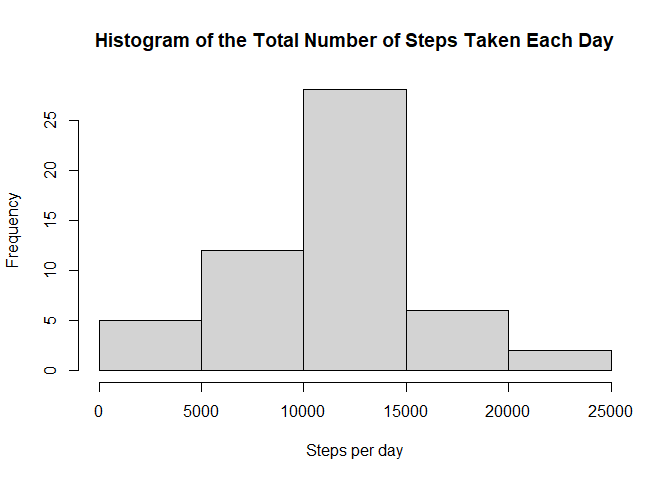
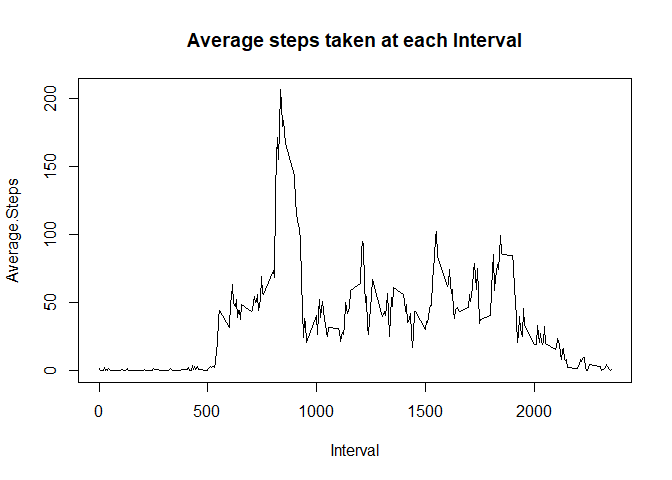
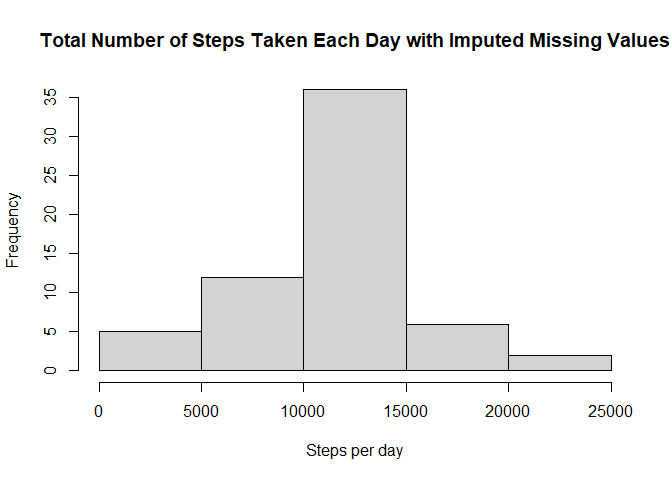
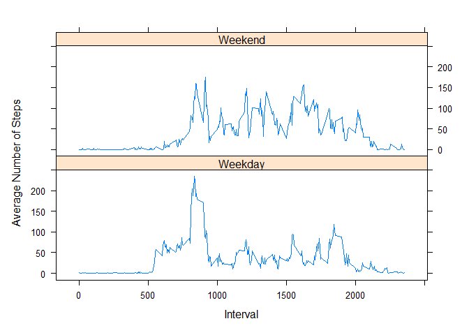

```r
knitr::opts_chunk$set(echo = TRUE)
```

1. Code for reading in the dataset and/or processing the data


```r
#Reads data
dt <- read.csv("activity.csv")
```

2. Histogram of the total number of steps taken each day


```r
#Calculates the Total steps for each day
dt1 <- with(dt, tapply(steps, date, sum))

#Creates histogram
hist(dt1, main = "Histogram of the Total Number of Steps Taken Each Day",
     xlab = "Steps per day")
```

<!-- -->

3. Mean and median number of steps taken each day


```r
#Converts the total steps for each day (dt1) to a data frame 
dt2 <- data.frame(Steps = dt1)

#Calculates the Mean number of steps taken each day
mean(dt2$Steps, na.rm = TRUE)
```

```
## [1] 10766.19
```


```r
#Calculates the Median number of steps taken each day
median(dt2$Steps, na.rm = TRUE)
```

```
## [1] 10765
```

4. Time series plot of the average number of steps taken


```r
#Calculates the mean value of steps at every interval across all days
dt3 <- with(dt, tapply(steps, interval, mean, na.rm = TRUE))

#Converts dt3 to a dataframe
dt4 <- data.frame(Interval = as.numeric(names(dt3)), Average.Steps = dt3)

#Plots line graph
with(dt4, plot(Interval, Average.Steps, type = "l", main = "Average steps taken at each Interval"))
```

<!-- -->

5. The 5-minute interval that, on average, contains the maximum number of steps


```r
#Determines the 5-minute interval that, on average, contains the maximum number of steps
dt4[which(dt4$Average.Steps == max(dt4$Average.Steps)), "Interval"]
```

```
## [1] 835
```

6. Code to describe and show a strategy for imputing missing data


```r
#Determines the number of NAs
sum(is.na(dt$steps))
```

```
## [1] 2304
```


```r
#Fills in missing data (NAs) with the mean value at that interval
dtf <- dt
for (i in 1:nrow(dtf)) {
  if(is.na(dtf[i, ]$steps)){
    dtf[i, ]$steps <- mean(dtf[which(dtf[i,]$interval == dtf$interval),]$steps,
                           na.rm = TRUE)
  }
}
```

7. Histogram of the total number of steps taken each day after missing values are imputed


```r
#Calculates the Total steps for each day with the imputed missing values
dt5 <- with(dtf, tapply(steps, date, sum))

#Creates histogram
hist(dt5, main = "Total Number of Steps Taken Each Day with Imputed Missing Values",
     xlab = "Steps per day")
```

<!-- -->


```r
#Converts the total steps for each day (dt5) to a data frame with the imputed missing values
dt6 <- data.frame(Steps = dt5)

#Calculates the Mean number of steps taken each day
mean(dt6$Steps, na.rm = TRUE)
```

```
## [1] 10766.19
```


```r
#Calculates the Median number of steps taken each day with the imputed missing values
median(dt6$Steps, na.rm = TRUE)
```

```
## [1] 10766.19
```
**Question:** Do these values differ from the estimates from the first part of the assignment? What is the impact of imputing missing data on the estimates of the total daily number of steps?

**Answer:** Yes, by imputing the missing values there are more observations which adds to the overall frequency of total daily number of steps in the histogram. Additionally, the median differs from the estimate in the first part of the assignment. By imputing the missing values with the mean at each interval, it makes the median now equivalent to the mean.


8. Panel plot comparing the average number of steps taken per 5-minute interval across weekdays and weekends


```r
#Converts date to POSIXt
dt$date <- as.Date(dt$date)

#Creates a day column that identifies the day of the week
dt$day <- weekdays(dt$date)

#Overwrites the day column and replaces it with "weekend" or "weekday"
for(i in 1:nrow(dt)) {
  if(dt[i, ]$day %in% c("Saturday", "Sunday")){
    dt[i, ]$day <- "Weekend"
  }
  else{
    dt[i, ]$day <- "Weekday"
  }
}

#Overwrites the step with the mean steps for each interval and weekday/weekend
aveSteps <- aggregate(steps ~ interval + day, data = dt, mean)

#Creates panel plot
library(lattice)
```

```
## Warning: package 'lattice' was built under R version 4.1.3
```

```r
xyplot(steps~interval | day, data = aveSteps, layout = c(1, 2), type = "l", 
       ylab = "Average Number of Steps", xlab = "Interval")
```

<!-- -->

